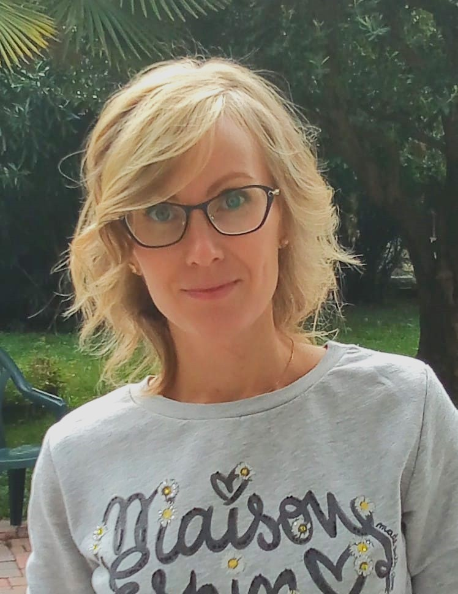

# Ksenia Pilshchikova
## Fullstack developer

> *Coding is my passion, learning every new technology inspires me and make me code-addicted. My previous work background were related to logistics but I decided to switch to follow my passion.*

### Education

- **Master in Mathematics**
    Ural State University, 2000 - 2005
- **Fullstack  developer**
    GoIT Academy, 10.2021 - 12.2022
- **Backend Node.JS developer**
    RS School, 01.2024 - 04.2024
- **English for developers**
    Yandex practicum,  10.2023 - 04.2024
- **AWS Cloud Developer**
    RS School, 05.2024 - 08.2024

### Experience

- **Full-stack developer, stage** [Bogoda project](https://guider.pro/). 10.2023 - 03.2024
    - Tourist guide  start-up project, use React, Next, Typescript, Firebase, FSD
    - Responsable of code review,   merging of the dev branches to the main repository and merge conflicts solving
    - Responsable of Firebase database operations and authentication 
    - Team work
- **Junior React developer, stage** [Easy improv](https://easy-improv.com/). 01/2023 - 05/2023
    - Created React components with hooks, used React router dom, Redux, Tilwind CSS, Typescript, Ant design, responsible layout
    - Testing with React testing Library
    - Team work

### Skills

- React , Redux, Next
- JS, Typescript
- Git
- CSS, SCSS, Tailwind CSS, styled components, BEM
- FSD architecture for Frontend
- Ant Design, Bootstrap
- REST API,  GraphQL
- TypeoRM, Prisma
- Node.js, Express, Nest, MongoDB, Websockets, Docker
- AWS Cloud (Lambda, API Gateway, EB, SNS, SQS, RDS)
- Firebase
- Jest, React Testing Library
- English - B2, Italian - fluent, Russian - native